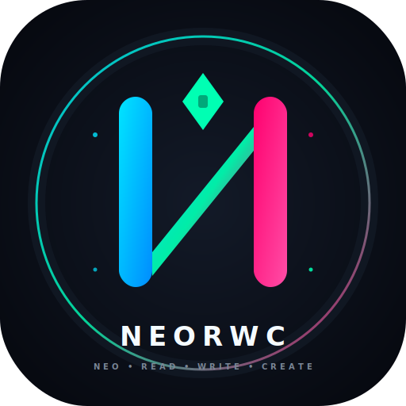

# neorwc




**neorwc** (Neo Read Write Create) is an AI-powered CLI that automates project documentation generation. It scans your codebase, analyzes project structure, and generates structured documentation using large language models from 7 different providers.

**Author:** RK Riad Khan ([rkriad585@gmail.com](mailto:rkriad585@gmail.com))  
**GitHub:** [github.com/rkriad585/neorwc-cli](https://github.com/rkriad585/neorwc-cli)

---

## Features

- **7 AI Providers** — Google Gemini, OpenAI, Anthropic Claude, DeepSeek, Mistral, Cohere, and local Ollama models
- **Persona Skills** — Load markdown-based skill files that change the AI's tone and focus (architect, developer, end-user docs)
- **Config TUI** — Interactive terminal UI for managing provider, model, API keys, and ignore patterns
- **Context-Aware Scanning** — Intelligent file filtering with glob-based ignore patterns and token estimation
- **Remote Templates** — Browse and install community documentation templates from GitHub
- **Tip System** — Random tips shown on startup (20+ categories covering git, bun, TypeScript, Docker, Python, CSS, security, performance, and more)
- **Dry-Run Mode** — Preview what files would be generated without writing anything
- **Persistent State** — Provider, model, and context settings persist across runs in global config
- **Self-Update** — Update to the latest version with `--update`
- **Self-Uninstall** — Cleanly remove neorwc and all config files with `--selfuninstall`
- **Cross-Platform** — Pre-built binaries for Windows, Linux, and macOS (x64 + arm64)
- **One-Line Install** — Install via PowerShell or curl pipe

---

## Quick Install

**Windows (PowerShell 7+):**
```powershell
irm https://raw.githubusercontent.com/rkriad585/neorwc-cli/main/installer.ps1 | iex
```

**Linux / macOS:**
```bash
curl -fsSL https://raw.githubusercontent.com/rkriad585/neorwc-cli/main/installer.sh | sh
```

The installer detects your OS and architecture, downloads the correct binary, and adds it to your PATH.

---

## Prerequisites (Source Mode)

If running from source instead of the binary:

- [Bun](https://bun.sh) v1.2+ runtime
- (Optional) [Ollama](https://ollama.com) for local AI models
- (Optional) API keys for cloud providers

---

## Usage

```bash
# Generate documentation for the current project
neorwc

# Use a specific provider
neorwc --provider google

# Use a specific model
neorwc --model gemini-2.5-flash

# Use a persona skill
neorwc --skill neorwc-architect

# Combine provider + model + skill
neorwc --provider openai --model gpt-4o --skill technical-writer

# Dry-run (preview without writing)
neorwc --dry-run
```

### Configuration

```bash
# Open the interactive config TUI
neorwc --config

# Initialize global config folder with starter skills
neorwc --init

# List installed skills and available providers
neorwc --list
```

### Templates

```bash
# List available remote templates from GitHub
neorwc --templates

# Install all templates
neorwc --install all

# Install a specific template
neorwc --install neorwc-architect
```

### Maintenance

```bash
# Self-update to the latest version
neorwc --update

# Self-uninstall (removes binary + config + PATH)
neorwc --selfuninstall
```

---

## CLI Options Reference

| Flag | Alias | Description |
|------|-------|-------------|
| `--model` | `-m` | AI model ID (e.g., `gemini-2.5-flash`, `gpt-4o`, `claude-3-opus`) |
| `--ctx` | `-c` | Override context window size in tokens |
| `--skill` | `-s` | Use a persona skill file from `~/.config/neostore/neorwc/skills/` |
| `--provider` | `-p` | AI provider: `google`, `openai`, `anthropic`, `deepseek`, `mistral`, `cohere`, `ollama` |
| `--init` | `-n` | Initialize `~/.config/neostore/neorwc` folder with default skill |
| `--templates` | `-t` | List available remote templates from GitHub |
| `--install` | `-i` | Install a template (`all` for everything) |
| `--list` | `-l` | List installed skills and available model providers |
| `--dry-run` | `-d` | Scan project and run AI without writing files |
| `--config` | `-g` | Open interactive TUI for editing configuration |
| `--update` | `-u` | Self-update to the latest version from GitHub releases |
| `--selfuninstall` | | Uninstall neorwc and remove all config files |

---

## AI Providers

| Provider | Env Variable | Models | API Type |
|----------|-------------|--------|----------|
| Google Gemini | `NEORWC_GOOGLE_KEY` | gemini-2.5-flash, gemini-2.0-flash, gemini-1.5-pro, etc. | REST (key in URL) |
| OpenAI | `OPENAI_API_KEY` | gpt-4o, gpt-4o-mini, o1, o3, etc. | OpenAI-compatible chat |
| Anthropic | `ANTHROPIC_API_KEY` | claude-3-opus, claude-3-sonnet, claude-3-haiku, etc. | Anthropic Messages API |
| DeepSeek | `DEEPSEEK_API_KEY` | deepseek-chat, deepseek-coder, etc. | OpenAI-compatible chat |
| Mistral | `MISTRAL_API_KEY` | mistral-large, mistral-medium, mistral-small, etc. | OpenAI-compatible chat |
| Cohere | `COHERE_API_KEY` | command-r, command-r-plus, command-light, etc. | Cohere Generate API |
| Ollama | (none) | llama3, mistral, codellama, etc. (local) | Ollama REST API |

The model list and context window sizes are fetched from **modelpedia** at runtime. Models are sorted by context window size (largest first) in the TUI.

---

## Configuration

### Global Config
`~/.config/neostore/neorwc/config.json` — stores provider, model, context window, API keys, and ignore patterns.

### Project State
`docs/.neorwc` — per-project state tracking the last used model, provider, and run timestamp.

### Config TUI
The `--config` flag launches an interactive configuration wizard built with **@clack/prompts**:
- **Provider selection** — pick from all 7 providers
- **Model selection** — browse models from modelpedia sorted by context size
- **API key input** — masked password prompt for the selected provider
- **Ignore patterns** — multi-line editor for glob patterns
- **Confirmation** — review and save with a single confirm prompt
- **Preview & save** — review all settings before saving

### Environment Variables
API keys can be set via env vars or saved via the TUI:
- `NEORWC_GOOGLE_KEY` — Google Gemini
- `OPENAI_API_KEY` — OpenAI
- `ANTHROPIC_API_KEY` — Anthropic Claude
- `DEEPSEEK_API_KEY` — DeepSeek
- `MISTRAL_API_KEY` — Mistral
- `COHERE_API_KEY` — Cohere

Provider resolution priority: env var > saved global config > error.

---

## Tip System

neorwc shows a random tip on every startup with 20+ categories:

| Category | Topics |
|----------|--------|
| neorwc | CLI shortcuts, features, config tips |
| bun | Bun runtime performance, packager tips |
| git | Version control best practices |
| typescript | Type safety, advanced types |
| json | JSON formatting, parsing |
| nodejs | Node.js patterns, async |
| cli | Terminal productivity |
| security | Secure coding practices |
| performance | Code optimization |
| markdown | Documentation formatting |
| design | Software design principles |
| debugging | Debugging techniques |
| testing | Test-driven development |
| css | Modern CSS (grid, container queries, :has()) |
| python | Pythonic patterns, type hints |
| docker | Dockerfile optimization, multi-stage builds |
| linux | CLI tools (grep, find, awk, sed) |
| npm | Package management, semantic versioning |
| api | RESTful design, HTTP status codes |
| database | Indexing, query optimization, migrations |

Tips are statically imported JSON files compiled into the binary for offline use.

---

## Building from Source

```bash
# Clone and install dependencies
git clone https://github.com/rkriad585/neorwc-cli
cd neorwc-cli
bun install

# Run in development mode
neorwc

# Build standalone binary for current platform
bun run scripts/build.ts

# Build for a specific target
bun run scripts/build.ts --target=bun-linux-x64
bun run scripts/build.ts --target=bun-darwin-arm64
```

### Cross-Platform Builds

**Windows:**
```powershell
.\build.ps1
.\build.ps1 linux       # Linux only
.\build.ps1 darwin      # macOS only
```

**Linux / macOS:**
```bash
./build.sh
./build.sh windows      # Windows only
./build.sh darwin       # macOS only
```

The build scripts:
1. Read the version from `.version` file
2. Get the latest git commit hash
3. Build for all 5 targets (windows-amd64, linux-amd64, linux-arm64, darwin-amd64, darwin-arm64)
4. Save binaries to `bin/` folder with the naming convention `neorwc-{os}-{arch}`

### Binary Naming Convention

| Platform | Binary Name |
|----------|-------------|
| Windows x64 | `neorwc-windows-amd64.exe` |
| Windows ARM64 | `neorwc-windows-arm64.exe` |
| Linux x64 | `neorwc-linux-amd64` |
| Linux ARM64 | `neorwc-linux-arm64` |
| macOS Intel | `neorwc-darwin-amd64` |
| macOS Apple Silicon | `neorwc-darwin-arm64` |

---

## Self-Update / Self-Uninstall

```bash
# Check for and install updates
neorwc --update

# Remove neorwc and all config files
neorwc --selfuninstall
```

The `--update` flag fetches the latest version from GitHub releases and replaces the current binary. On Windows, a temporary batch script handles the replacement since running executables cannot be overwritten in place.

The `--selfuninstall` flag removes:
- The binary from `~/.config/neostore/neorwc/bin/`
- The config directory `~/.config/neostore/neorwc/`
- Instructions for cleaning up PATH entries

You can also uninstall via the installer scripts:
```powershell
# Windows
irm https://raw.githubusercontent.com/rkriad585/neorwc-cli/main/installer.ps1 | iex --selfuninstall
```
```bash
# Linux / macOS
curl -fsSL https://raw.githubusercontent.com/rkriad585/neorwc-cli/main/installer.sh | sh -s -- --selfuninstall
```

---

## Architecture

```
neorwc.ts                  # CLI entry point (citty command definition)
├── src/core/
│   ├── ai.ts             # Provider resolution + prompt engineering + file writing
│   ├── config.ts         # Constants (API URLs, paths, colors, ignore patterns)
│   ├── config-manager.ts # Global config CRUD (load, save, merge)
 │   ├── config-tui.ts     # @clack/prompts interactive config wizard
│   ├── scanner.ts        # Project file scanner (Bun.Glob + ignore patterns)
│   ├── state.ts          # Per-project state persistence
│   ├── templates.ts      # Remote template fetching from GitHub API
│   └── __version.ts      # Auto-generated version injection
├── src/provider/
│   ├── google.ts         # Google Gemini provider
│   ├── openai.ts         # OpenAI provider
│   ├── anthropic.ts      # Anthropic Claude provider
│   ├── deepseek.ts       # DeepSeek provider
│   ├── mistral.ts        # Mistral provider
│   ├── cohere.ts         # Cohere provider
│   ├── ollama.ts         # Local Ollama provider
│   └── types.ts          # AiProvider interface + types
├── src/tips/
│   ├── tips.ts           # Tip system (random selection, banner display)
│   ├── index.ts          # Tip side-effect import
│   └── tips_template/    # 20+ static JSON tip files
├── scripts/
 │   └── build.ts          # Build script (version injection + compile)
├── logo/
│   └── logo.svg          # Project logo
├── build.ps1             # Cross-platform build (Windows)
├── build.sh              # Cross-platform build (Linux/macOS)
├── installer.ps1         # One-line PowerShell installer
├── installer.sh          # One-line shell installer
└── .version              # Version file (e.g., "v1.0.0")
```

---

## Development

```bash
# Run in development mode (source)
neorwc

# Type check
bunx tsc --noEmit

# Build standalone binary
bun run build
```

### Project Structure Notes

- **Provider pattern**: Each AI provider is a class implementing `AiProvider` with `getCapabilities()` and `generate()` methods. Providers use modelpedia for context window auto-detection.
- **Config priority**: Global config (`~/.config/neostore/neorwc/config.json`) > project state (`docs/.neorwc`) > hardcoded defaults.
- **API key resolution**: env var (e.g., `NEORWC_GOOGLE_KEY`) > saved global config > error.
- **Tips system**: Uses static JSON imports (not `import.meta.glob`) because `bun build --compile` doesn't support glob imports.
- **Status spinner**: Inline spinner implementation using `cli-spinners` frames (avoids ora dependency in compiled binary).

---

## License

ISC

Copyright (c) 2024 RK Riad Khan
